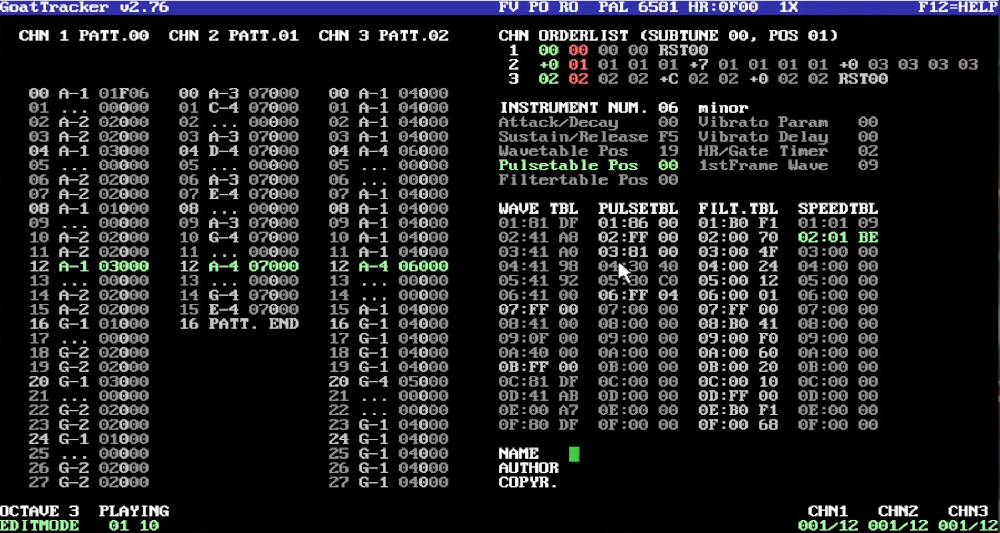

# C64/SID Tutorial

This is intended to be for a tutorial on how to compose in GoatTracker (2.76)

The .sid file can be played in all SID players such as VLC, the .sng file is for GoatTracker.

See associated video for creation of the song :

[Watch the GoatTracker Tutorial Video](https://www.youtube.com/watch?v=lCgQJFoqhNk)